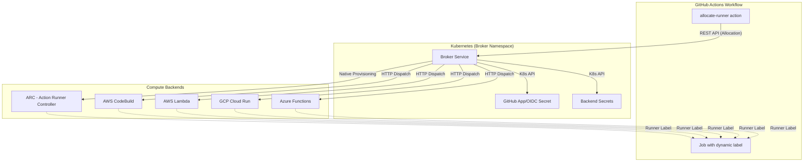
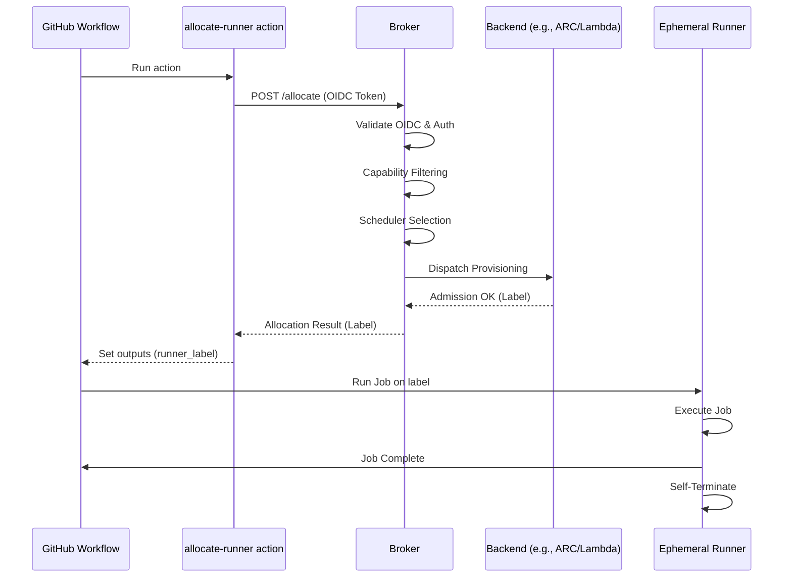
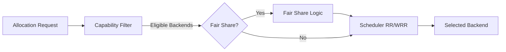

# unified-ephemeral-runner-broker

`unified-ephemeral-runner-broker` is a public control plane for allocating one-shot GitHub Actions runners across a unified ephemeral capacity pool.



V1 models exactly five backends:

- `arc`
- `codebuild`
- `lambda`
- `cloud-run`
- `azure-functions`

The public repo ships ARC provisioning plus generic secret-backed external launcher dispatch for `codebuild`, `lambda`, `cloud-run`, and `azure-functions`. Each enabled external backend must point at a real launcher controller through a Kubernetes secret in the broker namespace.

It is intentionally split into two capability pools:

- `full`: ARC only in v1
- `lite`: ARC plus the supported external backends

Default multi-backend scheduling is `round-robin`.

Built-in schedulers:

- `round-robin`
- `weighted-round-robin`

## What This Repo Ships

- A Kubernetes broker service with a small REST API
- A reusable GitHub Action, `allocate-runner`
- An OCI Helm chart for installation
- Generic provider runner images for `launcher`, `lambda`, `cloud-run`, and `azure-functions`
- A generic Kustomize-facing GitOps consumption path
- Generic infrastructure examples for AWS, GCP, and Azure

## What This Repo Does Not Ship

- Homelab-specific manifests, overlays, or secret-store implementations
- Inline credentials or cloud secrets
- Private runner labels, cluster names, or internal network details
- A public release workflow that can touch self-hosted runners

## High-Level Flow



1. A lightweight workflow step calls `allocate-runner`.
2. The broker selects an eligible backend from the chosen pool.
3. The broker sends the request to the selected backend integration. `codebuild`, `lambda`, `cloud-run`, and `azure-functions` dispatch through a secret-backed HTTP controller contract.
4. `job_timeout` is accepted as duration strings like `15m`, with numeric nanoseconds still accepted for backward compatibility.
5. The heavy workflow job runs on that exact label.
6. The runner executes one job and exits.

## Project Layout

- `cmd/broker`: broker entrypoint
- `internal/`: broker, scheduler, backend, GitHub, and config packages
- `docker/azure-functions`: published Azure Functions controller and runner container
- `docker/lambda`: published AWS Lambda runner container handler
- `charts/unified-ephemeral-runner-broker`: Helm chart
- `actions/allocate-runner`: public workflow integration surface
- `examples/`: generic Terraform and GitOps consumption examples
- `docs/`: architecture and security notes
- `observability/`: reusable Prometheus alert rules and Grafana dashboard artifacts

## Public CI and Private Release Boundary

This repository is designed for a split trust model:

- Public CI runs on GitHub-hosted runners only
- A separate private release repository owns the authoritative ARC-backed publish lane
- Public forks and PRs must never reach self-hosted runners or publish credentials

See [docs/architecture.md](docs/architecture.md) and [docs/security-boundary.md](docs/security-boundary.md) for the full model.

## Quick Start

1. Install the Helm chart with external backends disabled.
2. Create the GitHub auth secret and any enabled backend secrets in the same namespace as the broker.
   The broker validates referenced `secretRef` objects via the Kubernetes API and stays unready until they exist.
   External backend secrets should provide:
   `dispatch_url`: the controller endpoint the broker should call.
   `dispatch_token`: optional bearer token sent to that endpoint.
3. Point the `allocate-runner` action at the broker URL. The broker accepts `job_timeout` in the same duration-string format used by the action, for example `15m`.
4. Start with the `full` pool or ARC-only `lite` pool. Only enable an external backend after you have supplied a real launcher integration for that platform and the matching `secretRef`.

## Azure Functions Launcher

The published Azure Functions launcher image lives in `docker/azure-functions` and is designed for a Linux custom-container Function App.

- The HTTP dispatch endpoint returns quickly and enqueues the allocation.
- The broker waits up to 90 seconds for the Azure Functions dispatch controller so a cold-started Function App can return its admission response.
- A queue-triggered function execution runs the ephemeral GitHub runner inside the same Function App container.
- Use a hosting plan that supports long-running non-HTTP executions, such as Premium or Dedicated with `alwaysOn` enabled. The HTTP request still needs to finish quickly even when the runner job itself can run longer.

## Provider Runner Images

The private release lane should publish these OCI images from one immutable source ref:

- `broker`: Kubernetes broker API
- `launcher`: generic one-shot runner launcher
- `cloud-run`: Cloud Run Job runner image built from the generic launcher
- `lambda`: AWS Lambda container runner image with the Lambda runtime handler
- `azure-functions`: Azure Functions dispatch controller and runner image

Environment-specific repositories can mirror images when a provider requires it. For example, AWS Lambda requires the function image to live in ECR, so a private consumer may mirror the published `lambda` image into its own ECR repository while still treating this repo as the image source of truth.

## GitHub Scope

`github.scope.type` supports:

- `organization`
- `repository`

Repository scope requires `github.scope.owner` and `github.scope.repository`. Organization scope requires `github.scope.organization`.

## Scheduler Configuration



Each pool selects its scheduler with `pools[].scheduler`.

- `round-robin` is the default and ignores backend weights.
- `weighted-round-robin` uses `pools[].backends.<name>.weight`.
- Omitted or non-positive weights are treated as `1`.

Example:

```yaml
pools:
  - name: lite
    scheduler: weighted-round-robin
    backends:
      arc:
        enabled: true
        maxRunners: 2
        weight: 3
      codebuild:
        enabled: true
        maxRunners: 3
        weight: 1
```

`lambda` remains backward-compatible with older pinned requests: if the real `lambda` backend is disabled for a pool but `codebuild` is enabled, the broker treats a pinned `lambda` request as `codebuild`.

Rollback is just a config change: set `scheduler` back to `round-robin` for the pool and redeploy. Leaving `weight` values in place is safe because the default scheduler ignores them.

### Priority And Fair-Share Scheduling

Pools can opt into tenant-aware dispatch independently of the backend scheduler with `fairShare.enabled`.

```yaml
pools:
  - name: lite
    scheduler: weighted-round-robin
    fairShare:
      enabled: true
      priorityClasses:
        normal: 1
        high: 2
```

Allocation requests may include:

- `tenant`: queue, team, or workflow owner used for fair-share accounting
- `priority_class`: priority class such as `normal` or `high`

When enabled, fair-share admission prefers eligible backends with lower active load and lower active usage for the requesting tenant. Higher priority classes reduce the tenant penalty for that request, so urgent work can dispatch sooner when capacity is available. It does not preempt active runners, and allocations without a tenant use the `default` tenant bucket.

```yaml
- uses: ./actions/allocate-runner
  with:
    broker_url: https://broker.example.com
    pool: lite
    tenant: release
    priority_class: high
```

## Capability-Aware Routing

Jobs can further narrow backend selection with optional capability filters on the allocation request:

- `required_capabilities`: every listed tag must be advertised by the backend
- `excluded_capabilities`: none of the listed tags may be advertised by the backend
- Capability matching is case-insensitive and uses normalized string tags
- If neither field is set, broker behavior is unchanged

Capability filtering happens before the pool scheduler runs. The scheduler registry stays unchanged and only sees the eligible backends that remain after filtering.

Backend capability tags are configured per pool:

```yaml
pools:
  - name: lite
    scheduler: weighted-round-robin
    backends:
      arc:
        enabled: true
        maxRunners: 2
        capabilities:
          - cluster-local
          - docker
          - region:local
      codebuild:
        enabled: true
        maxRunners: 3
        capabilities:
          - region:aws-us-east-1
      cloud-run:
        enabled: true
        maxRunners: 2
        capabilities:
          - region:gcp-us-central1
```

Examples:

- Cluster-local routing:

```yaml
- uses: ./actions/allocate-runner
  with:
    broker_url: https://broker.example.com
    pool: lite
    required_capabilities: cluster-local
```

- GPU routing:

```yaml
- uses: ./actions/allocate-runner
  with:
    broker_url: https://broker.example.com
    pool: lite
    required_capabilities: gpu
```

This requires at least one backend in the selected pool to advertise `gpu`, for example an ARC template or cloud backend dedicated to GPU jobs.

- Region-specific routing:

```yaml
- uses: ./actions/allocate-runner
  with:
    broker_url: https://broker.example.com
    pool: lite
    required_capabilities: region:aws-us-east-1
    excluded_capabilities: cluster-local
```

If no backend matches the requested capability filters, the broker rejects the allocation request before scheduling.

## Observability

The broker exposes Prometheus metrics on `/metrics` and uses a shared `X-Correlation-ID` model across HTTP responses, allocation responses, and structured lifecycle logs. The reusable pack includes:

- `observability/grafana-dashboard.json`
- `observability/prometheus-rules.yaml`
- [docs/observability.md](docs/observability.md)

The pack observes allocation and backend lifecycle events without changing scheduling behavior.

## License

Apache-2.0
