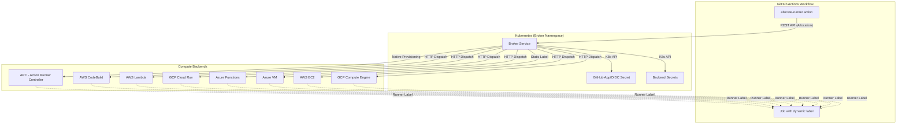
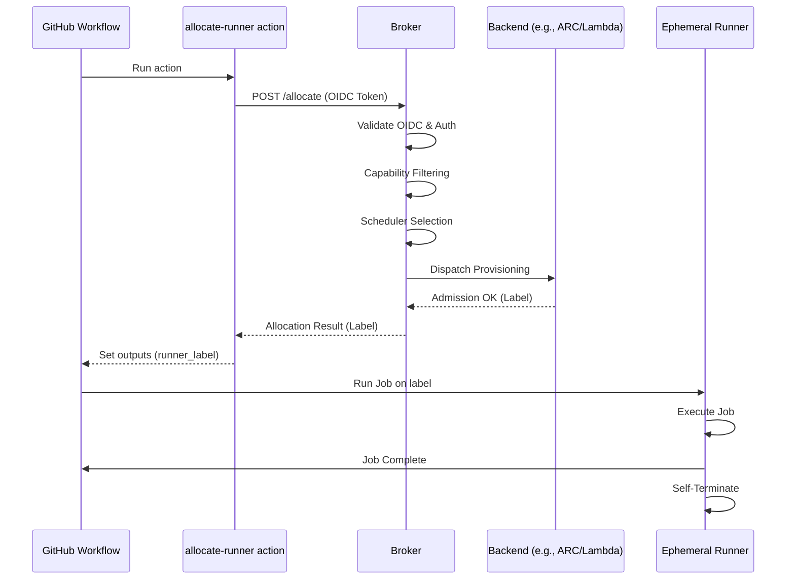
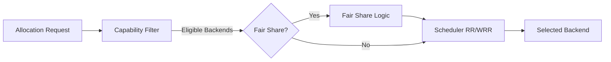

# unified-ephemeral-runner-broker

`unified-ephemeral-runner-broker` is a public control plane for allocating one-shot GitHub Actions runners across a unified ephemeral capacity pool.



V1 models these backends:

- `arc`
- `codebuild`
- `lambda`
- `cloud-run`
- `azure-functions`
- `azure-vm`
- `ec2`
- `gce`

The public repo ships ARC provisioning, a static-label VM adapter for existing Azure VM runners, and generic secret-backed external launcher dispatch for `codebuild`, `lambda`, `cloud-run`, `azure-functions`, `ec2`, and `gce`. Each enabled external backend must point at a real launcher controller through a Kubernetes secret in the broker namespace.

It is intentionally split into two capability pools:

- `full`: ARC only in v1
- `lite`: ARC plus the supported external and VM backends

Default multi-backend scheduling is `round-robin`.

Built-in schedulers:

- `round-robin`
- `weighted-round-robin`

## What This Repo Ships

- A Kubernetes broker service with a small REST API
- A reusable GitHub Action, `allocate-runner`
- A public backend adapter SDK with a conformance test harness
- An OCI Helm chart for installation
- Generic provider runner images for `launcher`, `lambda`, `cloud-run`, and `azure-functions`
- A generic Kustomize-facing GitOps consumption path
- Generic infrastructure examples for AWS, GCP, and Azure

## What This Repo Does Not Ship

- Homelab-specific manifests, overlays, or secret-store implementations
- Inline credentials or cloud secrets
- Private runner labels, cluster names, or internal network details
- A public release workflow that can touch self-hosted runners

## High-Level Flow



1. A lightweight workflow step calls `allocate-runner`.
2. The broker selects an eligible backend from the chosen pool.
3. The broker sends the request to the selected backend integration. `codebuild`, `lambda`, `cloud-run`, `azure-functions`, `ec2`, and `gce` dispatch through a secret-backed HTTP controller contract. `azure-vm` returns a configured existing runner label.
4. `job_timeout` is accepted as duration strings like `15m`, with numeric nanoseconds still accepted for backward compatibility.
5. The heavy workflow job runs on that exact label.
6. The runner executes one job and exits.

### Completion Callback Endpoint

The broker accepts completion callbacks on:

`POST /v1/allocations/{id}/complete`

Supported payload forms:

- `{ "state": "completed" }` (default state)
- `{ "state": "completed" | "failed" | "canceled", "reason": "...", "error": "..." }`
- `{ "state": "expired" }`
- `{ "state": "quarantined" }`

Duplicate callbacks for the same terminal state are idempotent and do not re-release scheduler capacity.

### Orphan cleanup and quarantine

Stale active allocations are reclaimed during periodic sweep.

```yaml
broker:
  orphanCleanup:
    enabled: false
    quarantineTTL: 15m
```

- `enabled: false` (default): active stale allocations move directly to `expired`.
- `enabled: true`: active stale allocations move to `quarantined` for `quarantineTTL` (or immediately when `0`), then to `expired`.

### Durable State Store

The broker keeps allocation state in memory by default. Environments that need
restart recovery can opt into a file-backed state store on a persistent volume.

```yaml
broker:
  stateStore:
    type: file
    path: /var/lib/uecb/allocations.json
```

On startup, active `reserved`, `ready`, and `warm` allocations are rehydrated
into scheduler accounting so a restarted broker does not over-admit capacity.

### Queued Admission

Queued admission is disabled by default. When enabled, retryable allocation
failures such as open backend circuits or transient provider dispatch failures
are stored as `pending` allocations. Capacity exhaustion and cold-launch rate
limits fail fast instead of entering the queue: rate-limited backends are
skipped in favor of another eligible backend, and the broker returns a direct
error when no backend can admit the request.

```yaml
broker:
  queue:
    enabled: true
    retryAfter: 30s
    maxAttempts: 3
```

`POST /v1/allocations` returns `202 Accepted` with `state: pending` and a
`Retry-After` header for queued allocations. The `allocate-runner` action polls
the allocation until it becomes `ready` or `queue_wait_timeout` expires.

## Project Layout

- `cmd/broker`: broker entrypoint
- `internal/`: broker, scheduler, backend, GitHub, and config packages
- `docker/azure-functions`: published Azure Functions controller and runner container
- `docker/lambda`: published AWS Lambda runner container handler
- `charts/unified-ephemeral-runner-broker`: Helm chart
- `actions/allocate-runner`: public workflow integration surface
- `examples/`: generic Terraform and GitOps consumption examples
- `docs/`: architecture and security notes
- `observability/`: reusable Prometheus alert rules and Grafana dashboard artifacts
- `pkg/adapter`: public backend adapter SDK and conformance test helpers

## Public CI and Private Release Boundary

This repository is designed for a split trust model:

- Public CI runs on GitHub-hosted runners only
- A separate private release repository owns the authoritative ARC-backed publish lane
- Public forks and PRs must never reach self-hosted runners or publish credentials

See [docs/architecture.md](docs/architecture.md) and [docs/security-boundary.md](docs/security-boundary.md) for the full model.

## Quick Start

1. Install the Helm chart with external backends disabled.
2. Create the GitHub auth secret and any enabled backend secrets in the same namespace as the broker.
   The broker validates referenced `secretRef` objects via the Kubernetes API and stays unready until they exist.
   External backend secrets should provide:
   `dispatch_url`: the controller endpoint the broker should call.
   `health_url`: health endpoint used by circuit-breaker recovery probes when the backend enables `circuitBreaker`.
   `dispatch_token`: optional bearer token sent to that endpoint.
3. Point the `allocate-runner` action at the broker URL. The broker accepts `job_timeout` in the same duration-string format used by the action, for example `15m`.
4. Start with the `full` pool or ARC-only `lite` pool. Only enable an external backend after you have supplied a real launcher integration for that platform and the matching `secretRef`.

## Azure Functions Launcher

The published Azure Functions launcher image lives in `docker/azure-functions` and is designed for a Linux custom-container Function App.

- The HTTP dispatch endpoint returns quickly and enqueues the allocation.
- The broker waits up to 90 seconds for the Azure Functions dispatch controller so a cold-started Function App can return its admission response.
- A queue-triggered function execution runs the ephemeral GitHub runner inside the same Function App container.
- Use a hosting plan that supports long-running non-HTTP executions, such as Premium or Dedicated with `alwaysOn` enabled. The HTTP request still needs to finish quickly even when the runner job itself can run longer.

## Provider Runner Images

The private release lane should publish these OCI images from one immutable source ref:

- `broker`: Kubernetes broker API
- `launcher`: generic one-shot runner launcher
- `cloud-run`: Cloud Run Job runner image built from the generic launcher
- `lambda`: AWS Lambda container runner image with the Lambda runtime handler
- `azure-functions`: Azure Functions dispatch controller and runner image

Environment-specific repositories can mirror images when a provider requires it. For example, AWS Lambda requires the function image to live in ECR, so a private consumer may mirror the published `lambda` image into its own ECR repository while still treating this repo as the image source of truth.

## GitHub Scope

`github.scope.type` supports:

- `organization`
- `repository`

Repository scope requires `github.scope.owner` and `github.scope.repository`. Organization scope requires `github.scope.organization`.

## Scheduler Configuration



Each pool selects its scheduler with `pools[].scheduler`.

- `round-robin` is the default and ignores backend weights.
- `weighted-round-robin` uses `pools[].backends.<name>.weight`.
- Omitted or non-positive weights are treated as `1`.

Example:

```yaml
pools:
  - name: lite
    scheduler: weighted-round-robin
    backends:
      arc:
        enabled: true
        maxRunners: 2
        weight: 3
      codebuild:
        enabled: true
        maxRunners: 3
        weight: 1
```

`lambda` remains backward-compatible with older pinned requests: if the real `lambda` backend is disabled for a pool but `codebuild` is enabled, the broker treats a pinned `lambda` request as `codebuild`.

Rollback is just a config change: set `scheduler` back to `round-robin` for the pool and redeploy. Leaving `weight` values in place is safe because the default scheduler ignores them.

## Tier-Aware Routing

Tier-aware routing can keep cloud backends from consuming paid capacity once provider free tiers, budgets, or credits are surpassed or close to exhausted. It is disabled by default and reads cached tier decisions during allocation; Prometheus and provider API calls happen outside the allocation path so runner assignment is not delayed by billing APIs.

```yaml
broker:
  tierRouting:
    enabled: true
    refreshInterval: 5m
    staleAfter: 15m
    failureMode: pass-through-round-robin
    fallbackBackends:
      - arc
    prometheus:
      url: https://prometheus.example.invalid
      timeout: 2s
      secretRef: uecb-prometheus
    providers:
      aws-main:
        provider: aws
        mode: free-tier
        secretRef: uecb-aws-billing
    providerRules:
      - name: aws-free-tier
        providerRef: aws-main
        hardLimitRatio: 0.95
        action: disable
pools:
  - name: lite
    backends:
      codebuild:
        tierRules:
          - name: codebuild-free-tier
            providerRef: aws-main
            usageQuery: uecb:backend_usage:ratio{backend="codebuild"}
            burnRateQuery: uecb:backend_usage_burn_rate{backend="codebuild"}
            softLimitRatio: 0.8
            hardLimitRatio: 0.95
            action: observe-only
```

`providerRules` apply one provider budget, free-tier, or credit decision to every matching backend in every pool. The broker maps `aws` to CodeBuild, Lambda, and EC2; `gcp` to Cloud Run and GCE; and `azure` to Azure Functions and Azure VM. Use `backends` on a provider rule when only a subset should be affected.

Supported fallback modes:

- `pass-through-round-robin`: default; unknown or stale tier data does not block builds.
- `block`: fail allocations when tier data is unknown, stale, or over policy.
- `fallback-backends`: route to configured fallback backends such as `arc`.

Use `observe-only` first, then move a provider or backend rule to `deprioritize` or `disable` after validating Prometheus queries and provider snapshots. Pinned requests fail clearly when the requested backend is tier-blocked.

## Runtime Backend Admission

Backends can opt into circuit breaking and cold-launch rate limiting. This is separate from static `enabled` and `healthy`: operator config is still the hard source of truth, while circuit state is learned at runtime per `pool/backend`.

The broker opens a circuit after configured timeout-like failures, transport errors, throttling, server errors, allocation expiry, or completion callbacks with `failure_class: wait-timeout`. Open backends are skipped for unpinned requests so another eligible backend can run the job; pinned requests fail fast.

```yaml
pools:
  - name: lite
    backends:
      azure-vm:
        enabled: true
        healthy: true
        maxRunners: 1
        runnerLabel: replace-with-private-azure-vm-runner-label
        circuitBreaker:
          enabled: true
          failureThreshold: 1
          evaluationWindow: 5m
          openDuration: 2m
          probeInterval: 30s
          probeTimeout: 10s
          recoverySuccessThreshold: 1
```

`rateLimit` applies only to cold provisioning attempts. Warm runner reuse is
not rate limited, and each cold launch attempt consumes a permit even if the
allocation is later canceled or fails downstream. When a cold backend is
rate-limited, the broker tries another eligible backend; if none can run the
allocation, the request fails fast with a rate-limit fallback exhaustion error
instead of waiting in the queue.

Unlike circuit-open or tier-policy rejections, rate limiting can still redirect
a pinned request to another eligible backend. Pinning remains a preference for
the first cold-launch attempt, not a guarantee that a rate-limited backend will
be retried in place.

## Warm Capacity

Backend pools can maintain pre-initialized warm runners to reduce cold-start latency for external backends.

Warm behavior is configured per backend:

- `warmMin`: minimum number of warm allocations to keep for the backend.
- `warmMax`: maximum number of warm allocations to keep for the backend.
- `warmTTL`: how long a warm allocation stays idle before recycle.

Warm allocations are created only for external backends that are enabled and healthy. `arc` and `azure-vm` are not included because they are not external dispatchers and are expected to launch quickly.

```yaml
pools:
  - name: lite
    backends:
      codebuild:
        enabled: true
        maxRunners: 3
        weight: 1
        warmMin: 1
        warmMax: 2
        warmTTL: 10m
        secretRef: uecb-codebuild
```

When warm capacity exists:

- the broker prefers an available warm slot before provisioning cold;
- idle warm runners are recycled on TTL expiry or capacity policy changes;
- warm capacity may consume active runner quota while in warm state.

If a warm slot is unavailable or expired, the broker falls back to cold launch as before.

Use warm pools where external cold-start latency dominates.

### Priority And Fair-Share Scheduling

Pools can opt into tenant-aware dispatch independently of the backend scheduler with `fairShare.enabled`.

```yaml
pools:
  - name: lite
    scheduler: weighted-round-robin
    fairShare:
      enabled: true
      priorityClasses:
        normal: 1
        high: 2
```

Allocation requests may include:

- `tenant`: queue, team, or workflow owner used for fair-share accounting
- `priority_class`: priority class such as `normal` or `high`

When enabled, fair-share admission prefers eligible backends with lower active load and lower active usage for the requesting tenant. Higher priority classes reduce the tenant penalty for that request, so urgent work can dispatch sooner when capacity is available. It does not preempt active runners, and allocations without a tenant use the `default` tenant bucket.

```yaml
- uses: ./actions/allocate-runner
  with:
    broker_url: https://broker.example.com
    pool: lite
    tenant: release
    priority_class: high
```

## Capability-Aware Routing

Jobs can further narrow backend selection with optional capability filters on the allocation request:

- `required_capabilities`: every listed tag must be advertised by the backend
- `excluded_capabilities`: none of the listed tags may be advertised by the backend
- Capability matching is case-insensitive and uses normalized string tags
- If neither field is set, broker behavior is unchanged

Capability filtering happens before the pool scheduler runs. The scheduler registry stays unchanged and only sees the eligible backends that remain after filtering.

Backend capability tags are configured per pool:

```yaml
pools:
  - name: lite
    scheduler: weighted-round-robin
    backends:
      arc:
        enabled: true
        maxRunners: 2
        capabilities:
          - cluster-local
          - docker
          - region:local
      codebuild:
        enabled: true
        maxRunners: 3
        capabilities:
          - docker
          - region:aws-us-east-1
      azure-vm:
        enabled: true
        maxRunners: 1
        runnerLabel: replace-with-private-azure-vm-runner-label
        capabilities:
          - docker
          - privileged
          - vm
          - cloud:azure
      cloud-run:
        enabled: true
        maxRunners: 2
        capabilities:
          - region:gcp-us-central1
```

Examples:

- Cluster-local routing:

```yaml
- uses: ./actions/allocate-runner
  with:
    broker_url: https://broker.example.com
    pool: lite
    required_capabilities: cluster-local
```

- Docker-capable routing:

```yaml
- uses: ./actions/allocate-runner
  with:
    broker_url: https://broker.example.com
    pool: lite
    required_capabilities: docker
```

This excludes serverless-only backends such as `lambda`, `cloud-run`, and `azure-functions` unless an environment explicitly advertises Docker support for those backends.

- GPU routing:

```yaml
- uses: ./actions/allocate-runner
  with:
    broker_url: https://broker.example.com
    pool: lite
    required_capabilities: gpu
```

This requires at least one backend in the selected pool to advertise `gpu`, for example an ARC template or cloud backend dedicated to GPU jobs.

- Region-specific routing:

```yaml
- uses: ./actions/allocate-runner
  with:
    broker_url: https://broker.example.com
    pool: lite
    required_capabilities: region:aws-us-east-1
    excluded_capabilities: cluster-local
```

If no backend matches the requested capability filters, the broker rejects the allocation request before scheduling.

## Observability

The broker exposes Prometheus metrics on `/metrics` and uses a shared `X-Correlation-ID` model across HTTP responses, allocation responses, and structured lifecycle logs. The reusable pack includes:

- `observability/grafana-dashboard.json`
- `observability/prometheus-rules.yaml`
- [docs/observability.md](docs/observability.md)

The pack observes allocation and backend lifecycle events without changing scheduling behavior.

## License

Apache-2.0
