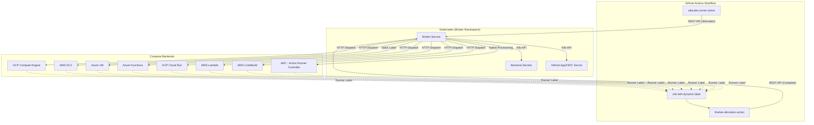
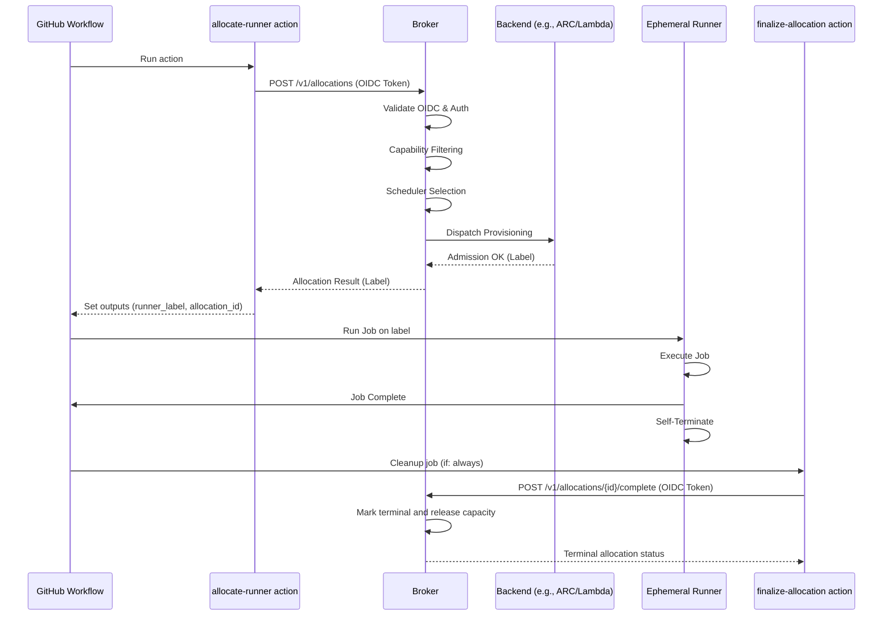
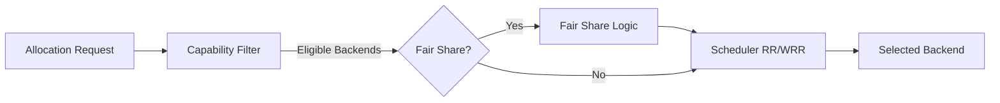

# unified-ephemeral-runner-broker

`unified-ephemeral-runner-broker` is a public control plane for allocating one-shot GitHub Actions runners across a unified ephemeral capacity pool.


```mermaid
graph TD
    subgraph "GitHub Actions Workflow"
        Step1[allocate-runner action]
        Step2[Job with dynamic label]
        Step3[finalize-allocation action]
    end

    subgraph "Kubernetes (Broker Namespace)"
        Broker[Broker Service]
        SecretAuth[GitHub App/OIDC Secret]
        SecretBackends[Backend Secrets]
    end

    subgraph "Compute Backends"
        ARC[ARC - Action Runner Controller]
        CB[AWS CodeBuild]
        Lambda[AWS Lambda]
        CR[GCP Cloud Run]
        AF[Azure Functions]
        AVM[Azure VM]
        EC2[AWS EC2]
        GCE[GCP Compute Engine]
    end

    Step1 -- "REST API (Allocation)" --> Broker
    Step3 -- "REST API (Complete)" --> Broker
    Broker -- "K8s API" --> SecretAuth
    Broker -- "K8s API" --> SecretBackends
    
    Broker -- "Native Provisioning" --> ARC
    Broker -- "HTTP Dispatch" --> CB
    Broker -- "HTTP Dispatch" --> Lambda
    Broker -- "HTTP Dispatch" --> CR
    Broker -- "HTTP Dispatch" --> AF
    Broker -- "Static Label" --> AVM
    Broker -- "HTTP Dispatch" --> EC2
    Broker -- "HTTP Dispatch" --> GCE

    ARC -. "Runner Label" .-> Step2
    CB -. "Runner Label" .-> Step2
    Lambda -. "Runner Label" .-> Step2
    CR -. "Runner Label" .-> Step2
    AF -. "Runner Label" .-> Step2
    AVM -. "Runner Label" .-> Step2
    EC2 -. "Runner Label" .-> Step2
    GCE -. "Runner Label" .-> Step2
    Step2 --> Step3
```

V1 models these backends:

- `arc`
- `codebuild`
- `lambda`
- `cloud-run`
- `azure-functions`
- `azure-vm`
- `ec2`
- `gce`

The public repo ships ARC provisioning, a static-label VM adapter for existing Azure VM runners, and generic secret-backed external launcher dispatch for `codebuild`, `lambda`, `cloud-run`, `azure-functions`, `ec2`, and `gce`. Each enabled external backend must point at a real launcher controller through a Kubernetes secret in the broker namespace.

It is intentionally split into two capability pools:

- `full`: ARC only in v1
- `lite`: ARC plus the supported external and VM backends

Default multi-backend scheduling is `round-robin`.

Built-in schedulers:

- `round-robin`
- `weighted-round-robin`

## What This Repo Ships

- A Kubernetes broker service with a small REST API
- Reusable GitHub Actions, `allocate-runner` and `finalize-allocation`
- A public backend adapter SDK with a conformance test harness
- An OCI Helm chart for installation
- Generic provider runner images for `launcher`, `lambda`, `cloud-run`, and `azure-functions`
- A generic Kustomize-facing GitOps consumption path
- Generic infrastructure examples for AWS, GCP, and Azure

## What This Repo Does Not Ship

- Homelab-specific manifests, overlays, or secret-store implementations
- Inline credentials or cloud secrets
- Private runner labels, cluster names, or internal network details
- A public release workflow that can touch self-hosted runners

## High-Level Flow


```mermaid
sequenceDiagram
    participant GH as GitHub Workflow
    participant AR as allocate-runner action
    participant B as Broker
    participant BE as Backend (e.g., ARC/Lambda)
    participant R as Ephemeral Runner
    participant FA as finalize-allocation action

    GH->>AR: Run action
    AR->>B: POST /v1/allocations (OIDC Token)
    B->>B: Validate OIDC & Auth
    B->>B: Capability Filtering
    B->>B: Scheduler Selection
    B->>BE: Dispatch Provisioning
    BE-->>B: Admission OK (Label)
    B-->>AR: Allocation Result (Label)
    AR-->>GH: Set outputs (runner_label, allocation_id)
    
    GH->>R: Run Job on label
    R->>R: Execute Job
    R->>GH: Job Complete
    R->>R: Self-Terminate

    GH->>FA: Cleanup job (if: always)
    FA->>B: POST /v1/allocations/{id}/complete (OIDC Token)
    B->>B: Mark terminal and release capacity
    B-->>FA: Terminal allocation status
```

1. A lightweight workflow step calls `allocate-runner`.
2. The broker selects an eligible backend from the chosen pool.
3. The broker sends the request to the selected backend integration. `codebuild`, `lambda`, `cloud-run`, `azure-functions`, `ec2`, and `gce` dispatch through a secret-backed HTTP controller contract. `azure-vm` returns a configured existing runner label.
4. `job_timeout` is accepted as duration strings like `15m`, with numeric nanoseconds still accepted for backward compatibility.
5. The heavy workflow job runs on that exact label.
6. The runner executes one job and exits.
7. A cleanup job (or step) calls `finalize-allocation` so the broker releases scheduler capacity immediately. If the callback never runs, orphan cleanup remains the fallback.

### Allocation API

Machine-readable reference: [docs/openapi.yaml](docs/openapi.yaml)
(`POST`/`GET` `/v1/allocations`, complete, cancel; OIDC auth and correlation headers).

All allocation endpoints require a GitHub OIDC bearer token unless
`allowUnauthenticated` is enabled.

| Operation | Method and path | Success response |
| --- | --- | --- |
| Create | `POST /v1/allocations` | `201 Created` when a runner is ready, or `202 Accepted` with a `Retry-After` header when queued |
| Status | `GET /v1/allocations/{id}` | `200 OK` with the current allocation |
| Cancel | `POST /v1/allocations/{id}/cancel` | `200 OK` with the canceled allocation |
| Complete | `POST /v1/allocations/{id}/complete` | `200 OK` with the terminal allocation |

Create requests include a pool and job timeout:

```json
{
  "pool": "full",
  "job_timeout": "15m"
}
```

Every successful operation returns the allocation status. A ready allocation
has this core response shape:

```json
{
  "allocation_id": "alloc-123",
  "correlation_id": "request-123",
  "pool": "full",
  "selected_backend": "arc",
  "runner_label": "uecb-alloc-123",
  "expires_at": "2026-07-17T12:00:00Z",
  "state": "ready"
}
```

Queued allocations use `state: pending`, may omit the runner label until they
are ready, and include `retry_after` in the response body.

Completion callbacks accept these payload forms:

- `{ "state": "completed" }` (default state)
- `{ "state": "completed" | "failed" | "canceled", "reason": "...", "error": "..." }`
- `{ "state": "expired" }`
- `{ "state": "quarantined" }`

Duplicate callbacks for the same terminal state are idempotent and do not
re-release scheduler capacity.

### Workflow finalization pattern

Without an explicit complete callback, active allocations keep consuming
scheduler capacity until orphan expiry. Use `finalize-allocation` in a cleanup
job that always runs after the runner job, including failure and cancellation.

GitHub `job.result` values map deterministically to broker terminal states:

| GitHub `job.result` / action `result` | Broker `state` |
| --- | --- |
| `success` | `completed` |
| `failure` | `failed` |
| `cancelled` / `canceled` | `canceled` |
| `skipped` | `canceled` (capacity still released) |

You can also pass broker states directly (`completed`, `failed`, `canceled`)
via `result` or the explicit `state` input (`state` wins when both are set).

```yaml
permissions:
  id-token: write   # required for broker OIDC unless allow_unauthenticated
  contents: read

jobs:
  allocate:
    runs-on: ubuntu-latest
    outputs:
      allocation_id: ${{ steps.alloc.outputs.allocation_id }}
      runner_label: ${{ steps.alloc.outputs.runner_label }}
    steps:
      - id: alloc
        uses: Josh-Archer/unified-ephemeral-runner-broker/actions/allocate-runner@main
        with:
          broker_url: https://broker.example.com
          pool: lite
          job_timeout: 15m

  work:
    needs: allocate
    runs-on: ${{ needs.allocate.outputs.runner_label }}
    steps:
      - run: echo "heavy job on ephemeral runner"

  # Always finalize so success, failure, and cancellation release capacity.
  finalize:
    needs: [allocate, work]
    if: ${{ always() && needs.allocate.result == 'success' }}
    runs-on: ubuntu-latest
    steps:
      - uses: Josh-Archer/unified-ephemeral-runner-broker/actions/finalize-allocation@main
        with:
          broker_url: https://broker.example.com
          allocation_id: ${{ needs.allocate.outputs.allocation_id }}
          result: ${{ needs.work.result }}
```

Notes:

- Grant `id-token: write` on the finalize job (or workflow) so OIDC matches
  `allocate-runner`. Local/dev brokers may set `allow_unauthenticated: true`.
- Transient HTTP failures (408/429/5xx and network errors) retry with bounded
  exponential backoff (`max_retries`, `initial_backoff_seconds`,
  `max_backoff_seconds`). Permanent failures (400/401/403/404) fail the step
  with an actionable error.
- Duplicate finalize runs for the same terminal state are safe; the broker
  treats them as idempotent and does not double-release capacity.
- If the finalize job cannot run (for example the workflow was deleted mid-run),
  orphan cleanup still reclaims capacity and runner labels after the job-timeout
  TTL—see below.

### Stuck-allocation reaper (orphan cleanup)

When finalize never runs (cancelled workflows, lost cleanup jobs), the broker-side
reaper reclaims capacity so stuck allocations cannot hold `maxRunners` forever.

A leader-only background loop (HA-safe under multi-replica postgres) periodically
reaps `reserved`/`ready` allocations past `expires_at` (set from `job_timeout`)
plus optional `gracePeriod`, marks them terminal, releases scheduler capacity,
and invokes provider cleanup hooks when available. Reaps are counted on
`uecb_allocations_reaped_total`.

```yaml
broker:
  orphanCleanup:
    enabled: false
    quarantineTTL: 15m
    gracePeriod: 0s   # wait this long after job_timeout before reaping
```

- `gracePeriod` (default `0s`): extra slack after the allocation deadline before
  capacity is reaped. Use a short grace when finalize may lag slightly past
  `job_timeout`.
- `enabled: false` (default): reaped allocations move directly to `expired`.
- `enabled: true`: reaped allocations move to `quarantined` for `quarantineTTL`
  (or immediately when `0`), then to `expired`. Capacity is released when the
  allocation first enters quarantine/expired.

### Durable State Store

The broker keeps allocation state in memory by default. Supported modes:

- `memory` — process-local (default). **Development only:** a process restart
  drops every in-flight allocation. Cloud runners keep running until provider
  timeout or workflow finalize, while the new process can over-admit work.
- `file` — process-local JSON file for single-replica restart recovery
- `postgres` — shared transactional store for multi-replica HA

```yaml
broker:
  stateStore:
    type: file
    path: /var/lib/uecb/allocations.json
```

Multi-replica deployments must use PostgreSQL:

```yaml
broker:
  stateStore:
    type: postgres
    dsnEnv: UECB_STATE_STORE_DSN
  ha:
    leaseTTL: 15s
```

Set `UECB_STATE_STORE_DSN` (or chart `config.broker.stateStore.secretRef`) to a
reachable Postgres DSN. The chart fails when `replicaCount > 1` unless
`stateStore.type` is `postgres`. Background sweeps run under a leader lease so
only one replica drives warm/queue/expiry reconciliation at a time.

On startup the broker:

1. Rehydrates active `reserved`, `ready`, and `warm` allocations into scheduler
   accounting (no-op for empty memory).
2. Quarantines or expires incomplete mid-allocate `reserved` records (no runner
   label), releases capacity, and best-effort cleans up reconstructed labels.
3. For process-local stores, compares provider `Capacity()` with local counts
   and installs short-lived capacity holds plus metrics when a gap suggests
   orphaned cloud runners after restart.

Use `file` or `postgres` whenever cloud backends are enabled in production. See
[docs/architecture.md](docs/architecture.md#failure-mode-in-memory--process-local-restart).

### Allocation Lifecycle Webhooks

Subscribe external systems to allocation lifecycle events (`ready`, `failed`,
`expired`, `completed`, `canceled`). Each endpoint receives a signed JSON POST
with exponential backoff retries. See
[docs/architecture.md](docs/architecture.md#allocation-lifecycle-webhooks) and
[docs/openapi.yaml](docs/openapi.yaml) for the envelope and signature contract.

```yaml
broker:
  webhooks:
    enabled: true
    timeout: 5s
    maxAttempts: 3
    initialBackoff: 500ms
    maxBackoff: 10s
    endpoints:
      - url: https://hooks.example.com/uecb
        signingSecretRef: uecb-webhook
        # events: []  # empty = all lifecycle events
```

Verify deliveries with HMAC-SHA256 of the raw body using the configured signing
secret. The signature is sent as `X-UECB-Signature: sha256=<hex>`.

### Live Backend Capacity

By default the broker routes using local scheduler accounting and configured
`maxRunners` only. Enable provider-reported capacity so exhausted external
providers are skipped without a config change:

```yaml
broker:
  liveCapacity:
    enabled: true
    refreshInterval: 30s
    staleAfter: 2m
    probeTimeout: 2s
    failureMode: pass-through   # or block
    refreshOnStartup: true
```

HTTP-dispatch backends publish capacity via optional secret key `capacity_url`.
Built-in `arc` implements first-class `Capacity()` (optional `capacity_url` or
configured runner-scale `maxRunners`); `desktop` reports `maxRunners` plus an
optional host probe. SDK adapters implement `Adapter.Capacity`. See
[docs/adapter-sdk.md](docs/adapter-sdk.md#publishing-capacity) and
[docs/architecture.md](docs/architecture.md#live-backend-capacity).

### Quality-Aware Auto Backend Selection

Beyond free slots alone, enable quality-aware ranking so unpinned allocations
prefer backends with better historical success rate, lower p95 ready latency,
and fewer recent capacity errors. Pins, capability filters, tier policy, and
live capacity still apply first; provision failure still falls back to other
eligible backends.

```yaml
broker:
  qualityAware:
    enabled: true
    window: 15m
    minSamples: 3
    weights:
      freeSlots: 1
      successRate: 1
      latency: 1
      capacityErrors: 1
```

Selection reasons are exported as `uecb_quality_selection_total` and logged as
`quality_selection` events. See
[docs/architecture.md](docs/architecture.md#quality-aware-auto-backend-selection)
and [docs/observability.md](docs/observability.md).

### Queued Admission

Queued admission is disabled by default. When enabled, retryable allocation
failures such as open backend circuits or transient provider dispatch failures
are stored as `pending` allocations. Capacity exhaustion and cold-launch rate
limits fail fast instead of entering the queue: rate-limited backends are
skipped in favor of another eligible backend, and the broker returns a direct
error when no backend can admit the request.

```yaml
broker:
  queue:
    enabled: true
    retryAfter: 30s
    maxAttempts: 3
```

`POST /v1/allocations` returns `202 Accepted` with `state: pending` and a
`Retry-After` header for queued allocations. The `allocate-runner` action polls
the allocation until it becomes `ready` or `queue_wait_timeout` expires.

## Project Layout

- `cmd/broker`: broker entrypoint
- `internal/`: broker, scheduler, backend, GitHub, and config packages
- `docker/azure-functions`: published Azure Functions controller and runner container
- `docker/lambda`: published AWS Lambda runner container handler
- `charts/unified-ephemeral-runner-broker`: Helm chart
- `actions/allocate-runner`: public allocate workflow integration surface
- `actions/finalize-allocation`: public complete/finalize workflow integration surface
- `examples/`: generic Terraform and GitOps consumption examples
- `docs/`: architecture notes, security boundary, and [OpenAPI](docs/openapi.yaml) for the allocation API
- `observability/`: reusable Prometheus alert rules and Grafana dashboard artifacts
- `pkg/adapter`: public backend adapter SDK and conformance test helpers

## Public CI and Private Release Boundary

This repository is designed for a split trust model:

- Public CI runs on GitHub-hosted runners only
- A separate private release repository owns the authoritative ARC-backed publish lane
- Public forks and PRs must never reach self-hosted runners or publish credentials

See [docs/architecture.md](docs/architecture.md) and [docs/security-boundary.md](docs/security-boundary.md) for the full model.

## Quick Start

1. Install the Helm chart with external backends disabled.
2. Create the GitHub auth secret and any enabled backend secrets in the same namespace as the broker.
   The broker validates referenced `secretRef` objects via the Kubernetes API and stays unready until they exist.
   External backend secrets should provide:
   `dispatch_url`: the controller endpoint the broker should call for provision.
   `health_url`: health endpoint used by circuit-breaker recovery probes when the backend enables `circuitBreaker`.
   `dispatch_token`: optional bearer token sent to dispatch, health, and cleanup endpoints.
   `cleanup_url` (optional): controller endpoint the broker POSTs on cancel/expire/release so the provider can tear down runners. When omitted, cleanup is skipped (capacity is still released); when set, launchers should treat cleanup as idempotent (2xx and 404 both OK).
   `capacity_url` (optional): GET endpoint returning provider free-slot JSON for live-capacity routing when `broker.liveCapacity.enabled` is true. See [docs/adapter-sdk.md](docs/adapter-sdk.md#publishing-capacity).
3. Point the `allocate-runner` action at the broker URL. The broker accepts `job_timeout` in the same duration-string format used by the action, for example `15m`.
4. Add a cleanup job that always calls `finalize-allocation` with the allocation ID and the runner job result so capacity is released immediately (see [Workflow finalization pattern](#workflow-finalization-pattern)).
5. Start with the `full` pool or ARC-only `lite` pool. Only enable an external backend after you have supplied a real launcher integration for that platform and the matching `secretRef`.

## Broker OIDC Authentication

When `broker.allowUnauthenticated` is false, allocation and completion requests
must use `Authorization: Bearer <token>` with a GitHub Actions OIDC token. The
broker discovers GitHub's JWKS from
`https://token.actions.githubusercontent.com/.well-known/openid-configuration`,
caches signing keys, and accepts only RS256 tokens signed by that issuer.

The token must include:

- `iss`: `https://token.actions.githubusercontent.com`
- `aud`: the configured `broker.api.oidcAudience` value, `uecb-broker` by default
- `sub`: a non-empty GitHub Actions subject such as `repo:OWNER/REPO:ref:...`
- current `exp` and, when present, `nbf` claims

Optional GitHub Actions claims used for authorization and ownership:

- `repository` (`owner/repo`)
- `repository_owner`
- `workflow_ref` / `job_workflow_ref` (retained for future policy)

### Authorization policy (`broker.api.oidcPolicy`)

Authentication alone is not multi-tenant isolation. Configure an allowlist when
the broker is reachable beyond a single trusted tenant:

```yaml
broker:
  api:
    oidcAudience: uecb-broker
    oidcPolicy:
      allowedRepositories:
        - my-org/my-repo
        - my-org/other-*
      allowedOwners:
        - my-org
```

- Empty `allowedRepositories` and `allowedOwners` (default): any **authenticated**
  identity may allocate (backward compatible for single-tenant trusted deploys).
- Non-empty lists: the caller's repository or owner must match at least one entry
  (union). Patterns support a trailing `/*` (or `*`) wildcard.
- Policy denial returns HTTP 403.

### Allocation ownership (IDOR protection)

On allocate, the broker stores the OIDC principal (`subject`, `repository`,
`owner`) on the allocation. Get / cancel / complete require the same `sub` (or
the same `repository` when both sides present it). Cross-tenant access returns
HTTP 403. When `allowUnauthenticated` is true and the request has no bearer
token, ownership checks are skipped so local/test modes keep working.

Set `broker.allowUnauthenticated: true` only behind a separate trusted network
or gateway boundary. For multi-tenant or internet-exposed brokers, keep
authentication required and set a non-empty `oidcPolicy`.

## Azure Functions Launcher

The published Azure Functions launcher image lives in `docker/azure-functions` and is designed for a Linux custom-container Function App.

- The HTTP dispatch endpoint returns quickly and enqueues the allocation.
- The broker waits up to 90 seconds for the Azure Functions dispatch controller so a cold-started Function App can return its admission response.
- A queue-triggered function execution runs the ephemeral GitHub runner inside the same Function App container.
- A timer-triggered status reaper deletes terminal blobs past TTL and non-terminal blobs past runner timeout + grace so the status container stays bounded without relying only on capacity probes. Capacity GETs still reap opportunistically using the same metadata rules.
- Use a hosting plan that supports long-running non-HTTP executions, such as Premium or Dedicated with `alwaysOn` enabled. The HTTP request still needs to finish quickly even when the runner job itself can run longer.

## Provider Runner Images

The private release lane should publish these OCI images from one immutable source ref:

- `broker`: Kubernetes broker API
- `launcher`: generic one-shot runner launcher
- `cloud-run`: Cloud Run Job runner image built from the generic launcher
- `lambda`: AWS Lambda container runner image with the Lambda runtime handler
- `azure-functions`: Azure Functions dispatch controller and runner image

Environment-specific repositories can mirror images when a provider requires it. For example, AWS Lambda requires the function image to live in ECR, so a private consumer may mirror the published `lambda` image into its own ECR repository while still treating this repo as the image source of truth.

### Image provenance and SBOM verification

The public `Publish Runtime Images` workflow binds SLSA provenance and SPDX SBOM
attestations to each pushed image digest without changing the Lambda Docker v2
single-manifest format. After a release publish, consumers can verify:

```bash
REPO=Josh-Archer/unified-ephemeral-runner-broker

gh attestation verify oci://ghcr.io/josh-archer/uecb-lambda:TAG -R "${REPO}"
gh attestation verify oci://ghcr.io/josh-archer/uecb-lambda:TAG -R "${REPO}" \
  --predicate-type https://spdx.dev/Document/v2.3
```

Copy-paste commands for all three runtime images (and Lambda manifest checks)
are in [docs/image-attestations.md](docs/image-attestations.md).

## GitHub Scope

`github.scope.type` supports:

- `organization`
- `repository`

Repository scope requires `github.scope.owner` and `github.scope.repository`. Organization scope requires `github.scope.organization`.

## Scheduler Configuration


```mermaid
graph LR
    Req[Allocation Request] --> Cap[Capability Filter]
    Cap -- "Eligible Backends" --> FS{Fair Share?}
    FS -- "Yes" --> FSL[Fair Share Logic]
    FSL --> Sched[Scheduler RR/WRR]
    FS -- "No" --> Sched
    Sched --> BE[Selected Backend]
```

Each pool selects its scheduler with `pools[].scheduler`.

- `round-robin` is the default and ignores backend weights.
- `weighted-round-robin` uses `pools[].backends.<name>.weight`.
- Omitted or non-positive weights are treated as `1`.

Example:

```yaml
pools:
  - name: lite
    scheduler: weighted-round-robin
    backends:
      arc:
        enabled: true
        maxRunners: 2
        weight: 3
      codebuild:
        enabled: true
        maxRunners: 3
        weight: 1
```

`lambda` remains backward-compatible with older pinned requests: if the real `lambda` backend is disabled for a pool but `codebuild` is enabled, the broker treats a pinned `lambda` request as `codebuild`.

Rollback is just a config change: set `scheduler` back to `round-robin` for the pool and redeploy. Leaving `weight` values in place is safe because the default scheduler ignores them.

## Tier-Aware Routing

Tier-aware routing can keep cloud backends from consuming paid capacity once provider free tiers, budgets, or credits are surpassed or close to exhausted. It is disabled by default and reads cached tier decisions during allocation; Prometheus and provider API calls happen outside the allocation path so runner assignment is not delayed by billing APIs.

```yaml
broker:
  tierRouting:
    enabled: true
    refreshInterval: 5m
    staleAfter: 15m
    failureMode: pass-through-round-robin
    fallbackBackends:
      - arc
    prometheus:
      url: https://prometheus.example.invalid
      timeout: 2s
      secretRef: uecb-prometheus
    providers:
      aws-main:
        provider: aws
        mode: free-tier
        secretRef: uecb-aws-billing
    providerRules:
      - name: aws-free-tier
        providerRef: aws-main
        hardLimitRatio: 0.95
        action: disable
pools:
  - name: lite
    backends:
      codebuild:
        tierRules:
          - name: codebuild-free-tier
            providerRef: aws-main
            usageQuery: uecb:backend_usage:ratio{backend="codebuild"}
            burnRateQuery: uecb:backend_usage_burn_rate{backend="codebuild"}
            softLimitRatio: 0.8
            hardLimitRatio: 0.95
            action: observe-only
```

`providerRules` apply one provider budget, free-tier, or credit decision to every matching backend in every pool. The broker maps `aws` to CodeBuild, Lambda, and EC2; `gcp` to Cloud Run and GCE; and `azure` to Azure Functions and Azure VM. Use `backends` on a provider rule when only a subset should be affected.

Supported fallback modes:

- `pass-through-round-robin`: default; unknown or stale tier data does not block builds.
- `block`: fail allocations when tier data is unknown, stale, or over policy.
- `fallback-backends`: route to configured fallback backends such as `arc`.

Use `observe-only` first, then move a provider or backend rule to `deprioritize` or `disable` after validating Prometheus queries and provider snapshots. Pinned requests fail clearly when the requested backend is tier-blocked.

## Runtime Backend Admission

Backends can opt into circuit breaking and cold-launch rate limiting. This is separate from static `enabled` and `healthy`: operator config is still the hard source of truth, while circuit state is learned at runtime per `pool/backend`.

The broker opens a circuit after configured timeout-like failures, transport errors, throttling, server errors, allocation expiry, or completion callbacks with `failure_class: wait-timeout`. Open backends are skipped for unpinned requests so another eligible backend can run the job; pinned requests fail fast.

```yaml
pools:
  - name: lite
    backends:
      azure-vm:
        enabled: true
        healthy: true
        maxRunners: 1
        runnerLabel: replace-with-private-azure-vm-runner-label
        circuitBreaker:
          enabled: true
          failureThreshold: 1
          evaluationWindow: 5m
          openDuration: 2m
          probeInterval: 30s
          probeTimeout: 10s
          recoverySuccessThreshold: 1
```

`rateLimit` applies only to cold provisioning attempts. Warm runner reuse is
not rate limited, and each cold launch attempt consumes a permit even if the
allocation is later canceled or fails downstream. When a cold backend is
rate-limited, the broker tries another eligible backend; if none can run the
allocation, the request fails fast with a rate-limit fallback exhaustion error
instead of waiting in the queue.

Unlike circuit-open or tier-policy rejections, rate limiting can still redirect
a pinned request to another eligible backend. Pinning remains a preference for
the first cold-launch attempt, not a guarantee that a rate-limited backend will
be retried in place.

## Warm Capacity

Backend pools can maintain pre-initialized warm runners to reduce cold-start latency for **cold cloud backends** (`lambda`, `cloud-run`, `azure-functions`, plus other external dispatchers: `codebuild`, `ec2`, `gce`).

Warm behavior is configured per backend:

- `warmMin`: minimum number of warm allocations to keep for the backend.
- `warmMax`: maximum number of warm allocations to keep for the backend.
- `warmTTL`: how long a warm allocation stays idle before recycle.
- `warmSchedule` (optional): calendar windows when warm targets apply. Outside every window the effective target is zero so capacity can stay cold off-hours.

Warm allocations are created only for warm-capable external backends that are enabled and healthy. `arc`, `azure-vm`, and `desktop` are excluded (fast or persistent runners).

```yaml
pools:
  - name: lite
    backends:
      codebuild:
        enabled: true
        maxRunners: 3
        weight: 1
        warmMin: 1
        warmMax: 2
        warmTTL: 10m
        secretRef: uecb-codebuild
      lambda:
        enabled: true
        maxRunners: 3
        warmMin: 0          # baseline off-window
        warmMax: 0
        warmTTL: 10m
        # Pre-warm only during weekday CI hours (cost control).
        warmSchedule:
          timezone: America/New_York
          windows:
            - days: [mon, tue, wed, thu, fri]
              start: "08:00"
              end: "18:00"
              warmMin: 1
              warmMax: 2
        secretRef: uecb-lambda
```

When warm capacity exists:

- auto (unpinned) selection prefers a backend that already holds idle warm capacity;
- the broker consumes an available warm slot before provisioning cold on that backend;
- idle warm runners are recycled on TTL expiry, schedule off-window, or capacity policy changes;
- warm capacity consumes active runner quota while in warm state;
- with `broker.liveCapacity.enabled`, warm refill respects provider `Capacity()` / `free_slots` so pre-warm does not intentionally overrun live headroom.

If a warm slot is unavailable or expired, the broker falls back to cold launch as before.

### Cost controls

Warm runners are **billed while idle** by the cloud provider (function instances, containers, or VMs held ready). Treat warm size as a cost dial:

| Control | Effect |
|---------|--------|
| `warmMin: 0` / `warmMax: 0` | Disable warm for a backend without disabling the backend |
| `warmMax` | Hard cap on concurrent idle warm runners |
| `warmTTL` | Recycle idle warm slots so long-lived idle cost is bounded |
| `warmSchedule` | Keep warm only during known CI windows; drain outside windows |
| `maxRunners` | Global ceiling shared by warm + active jobs |
| Live capacity | When enabled, warm growth stops when provider free slots are exhausted |
| Tier routing | Warm refill is skipped when the backend is tier-blocked |

**Guidance**

- Free-tier or bursty Azure Functions lanes usually stay cold (`warmMin`/`warmMax` 0).
- Prefer schedule windows over always-on warm when traffic is business-hours CI.
- Keep `warmMax` small (1–2) unless p95 allocate→ready smoke shows cold starts dominating UX.
- Monitor `uecb_launch_latency_seconds{launch_mode="warm"|"cold"}` and provider spend; shrink warm if idle cost exceeds latency benefit.

Use warm pools where external cold-start latency dominates.

### Priority And Fair-Share Scheduling

Pools can opt into tenant- and lane-aware dispatch with `fairShare.enabled`. Fair-share **composes** with the pool's backend scheduler (`round-robin` or `weighted-round-robin`):

1. **Tenant admission** — enforce optional per-tenant `quotas` (repo, workflow label, or other queue identity), track active usage by tenant and priority class.
2. **Soft reserves** — optional `softReserves` hold slots on each backend for higher-weight lanes so concurrent low-priority load cannot fill `maxRunners` and starve deploy/PR gates.
3. **Fair-share ranking** — prefer backends with lower active load and lower active usage for the requesting tenant; higher priority classes reduce the tenant penalty when capacity is available.
4. **Backend pick** — among backends with equal fair-share scores and free capacity, select using the pool scheduler. With `weighted-round-robin`, backend `weight` values still shape selection; with `round-robin`, each eligible backend gets one slot.

#### Priority rules

| Rule | Behavior |
|------|----------|
| `priorityClasses` weights | Higher weight = higher lane (example: `deploy: 3` > `pr: 2` > `smoke: 1`). Built-in defaults: `high=2`, `normal=1` (and empty). |
| Soft reserve admission | For a request, `effectiveMax = maxRunners - sum(softReserves[class] where weight(class) > weight(request))`. Lower lanes cannot use those slots. |
| Higher lane access | Protected classes still see the full `maxRunners` budget (soft reserves do not shrink their own capacity). |
| Tenant quotas | Hard concurrent caps per `tenant` string across backends in the pool. |
| No preemption | Active runners are never cancelled for a higher lane; soft reserves only shape *new* admissions. |

Recommended configuration (lane priorities + soft reserve + tenant fair-share):

```yaml
pools:
  - name: lite
    scheduler: weighted-round-robin   # weights apply when fair-share scores tie
    fairShare:
      enabled: true
      priorityClasses:                # lane / risk tiers (home-style deploy > pr > smoke)
        smoke: 1
        pr: 2
        deploy: 3
        normal: 1                     # aliases still accepted
        high: 2
      softReserves:                   # hold slots so low lanes cannot starve high
        deploy: 1
        pr: 1
      quotas:                         # optional hard caps on concurrent active allocations
        noisy-team: 4
        release: 20
    backends:
      arc:
        enabled: true
        maxRunners: 4
        weight: 3
      codebuild:
        enabled: true
        maxRunners: 4
        weight: 2
```

With `maxRunners: 4`, `softReserves.deploy: 1`, and `softReserves.pr: 1`, smoke traffic can use at most 2 slots per backend while deploy and pr can still admit into the held capacity.

Allocation requests may include:

- `tenant`: queue, team, repo, or workflow owner used for fair-share accounting and optional quotas
- `priority_class`: lane / priority class such as `deploy`, `pr`, `smoke`, `normal`, or `high`

Fair-share does not preempt active runners. Allocations without a tenant use the `default` tenant bucket. Optional `fairShare.quotas` reject new reservations for a tenant once its concurrent active count reaches the configured limit (other tenants are unaffected). Soft reserves require `fairShare.enabled: true`.

`usageWindow` and `starvationAfter` are reserved config keys and are not applied yet.

#### Config surface (single path)

| Knob | Role |
|------|------|
| `pools[].fairShare.enabled: true` | **Recommended** enable path for tenant/priority admission and ranking |
| `pools[].fairShare.priorityClasses` | Named lane weights (`deploy` / `pr` / `smoke` or `high` / `normal`) |
| `pools[].fairShare.softReserves` | Soft-held slots per higher lane so low-priority load cannot block them |
| `pools[].fairShare.quotas` | Optional hard concurrent caps keyed by `tenant` (repo/workflow label) |
| `pools[].scheduler: weighted-round-robin` / `round-robin` | Backend selection among equal fair-share scores (weights only for WRR) |
| `pools[].scheduler: priority-fair-share` | Standalone fair-share backend pick (no weight expansion); same shared scheduler instance as `fairShare.enabled` |

Prefer `fairShare.enabled` plus `weighted-round-robin` or `round-robin`. Setting `scheduler: priority-fair-share` alone is equivalent to fair-share ranking without WRR weight expansion.

```yaml
- uses: ./actions/allocate-runner
  with:
    broker_url: https://broker.example.com
    pool: lite
    tenant: release
    priority_class: deploy
```

## Capability-Aware Routing

Jobs can further narrow backend selection with optional capability filters on the allocation request:

- `required_capabilities`: every listed tag must be advertised by the backend
- `excluded_capabilities`: none of the listed tags may be advertised by the backend
- Capability matching is case-insensitive and uses normalized string tags
- Platform dimensions: `os:linux` / `os:windows` / `os:macos` and `arch:amd64` / `arch:arm64` (aliases such as `windows`, `arm64`, and `x64` expand automatically)
- The `allocate-runner` action also accepts first-class `os` and `arch` inputs that merge into `required_capabilities`
- If neither field is set, broker behavior is unchanged

Capability filtering happens before the pool scheduler runs. The scheduler registry stays unchanged and only sees the eligible backends that remain after filtering.

Full schema and alias table: [docs/capabilities.md](docs/capabilities.md). Example workflow: [examples/workflows/platform-routing.yml](examples/workflows/platform-routing.yml).

Backend capability tags are configured per pool:

```yaml
pools:
  - name: lite
    scheduler: weighted-round-robin
    backends:
      arc:
        enabled: true
        maxRunners: 2
        capabilities:
          - os:linux
          - arch:amd64
          - cluster-local
          - docker
          - region:local
      codebuild:
        enabled: true
        maxRunners: 3
        capabilities:
          - os:linux
          - arch:amd64
          - docker
          - region:aws-us-east-1
      azure-vm:
        enabled: true
        maxRunners: 1
        runnerLabel: replace-with-private-azure-vm-runner-label
        capabilities:
          - os:linux
          - arch:amd64
          - docker
          - privileged
          - vm
          - cloud:azure
      cloud-run:
        enabled: true
        maxRunners: 2
        capabilities:
          - os:linux
          - arch:amd64
          - region:gcp-us-central1
```

Examples:

- Cluster-local routing:

```yaml
- uses: ./actions/allocate-runner
  with:
    broker_url: https://broker.example.com
    pool: lite
    required_capabilities: cluster-local
```

- Docker-capable routing:

```yaml
- uses: ./actions/allocate-runner
  with:
    broker_url: https://broker.example.com
    pool: lite
    required_capabilities: docker
```

This excludes serverless-only backends such as `lambda`, `cloud-run`, and `azure-functions` unless an environment explicitly advertises Docker support for those backends.

- Windows + arm64 routing:

```yaml
- uses: ./actions/allocate-runner
  with:
    broker_url: https://broker.example.com
    pool: lite
    os: windows
    arch: arm64
```

Equivalent capability tags: `required_capabilities: os:windows,arch:arm64` (or aliases `windows,arm64`). Default backends advertise Linux/amd64 only; enable and tag a Windows/arm64 backend (for example a dedicated VM label) before using this filter.

- GPU routing:

```yaml
- uses: ./actions/allocate-runner
  with:
    broker_url: https://broker.example.com
    pool: lite
    required_capabilities: gpu
```

This requires at least one backend in the selected pool to advertise `gpu`, for example an ARC template or cloud backend dedicated to GPU jobs.

- Region-specific routing:

```yaml
- uses: ./actions/allocate-runner
  with:
    broker_url: https://broker.example.com
    pool: lite
    required_capabilities: region:aws-us-east-1
    excluded_capabilities: cluster-local
```

If no backend matches the requested capability filters, the broker rejects the allocation request before scheduling.

## Observability

The broker exposes Prometheus metrics on `/metrics` and uses a shared `X-Correlation-ID` model across HTTP responses, allocation responses, and structured lifecycle logs. The reusable pack includes:

- `observability/grafana-dashboard.json`
- `observability/prometheus-rules.yaml`
- [docs/observability.md](docs/observability.md)

The pack observes allocation and backend lifecycle events without changing scheduling behavior.

## License

Apache-2.0
